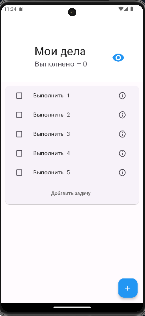
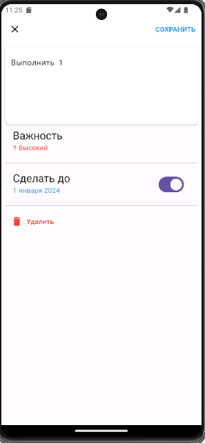
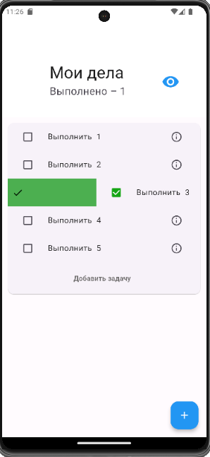

todo app- это простое и удобное приложение для управления вашими задачами. 
С помощью этого приложения вы можете легко создавать, редактировать и удалять задачи, а также отмечать их как выполненные.

## Основные функции

- **Создание задач:** Легко добавляйте новые задачи с помощью интуитивно понятного интерфейса.
- **Редактирование задач:** Изменяйте детали задач в любое время.
- **Удаление задач:** Быстро удаляйте ненужные задачи.
- **Отметка задач как выполненные:** Отмечайте задачи как выполненные и управляйте их состоянием.

## Скриншоты

### Главный экран


### Создание новой задачи


### Редактирование задачи


### Задача выполнена


Также добавлена иконка приложения:
(assets/image/icon.png)

## Установка

1. Клонируйте репозиторий:
    ```sh
    git clone https://github.com/yourusername/todo-app.git
    ```
2. Перейдите в директорию проекта:
    ```sh
    cd todo-app
    ```
3. Установите зависимости:
    ```sh
    npm install
    ```
4. Запустите приложение:
    ```sh
    npm start

